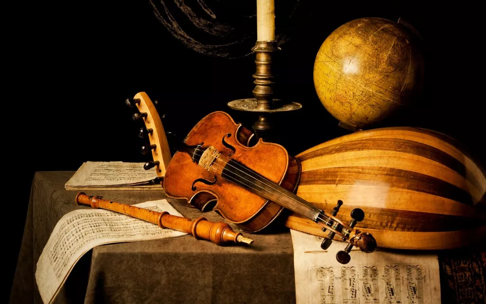

# SVG Icon Set Project

## CLASSCIAL MUSIC INSTRUMENTS ICON SET


### About

This is the project which gives you more information about the classical instruments which were used well in ancient era and some countries are still famous for their classical music.

```[Small History Of Classical Music]```

Classical music is art music produced or rooted in the traditions of Western culture, including both liturgical (religious) and secular music. While a more precise term is also used to refer to the period from 1750 to 1820 (the Classical period), this article is about the broad span of time from before the 6th century AD to the present day, which includes the Classical period and various other periods. The central norms of this tradition became codified between 1550 and 1900, which is known as the common-practice period.

### Getting Started

There are certain steps needs to be completed before making actual project using any languages.
1. Research and Brain Storm about the Client's Requirement
2. Visualize the data and carve ideas into blank paper
3. After deciding the best design from the paper sketch, start to design your website by using
```Adobe Illustrator``` and ```Adobe Photoshop```
4. Send your design to client for conformation otherwise re-work on it.
5. After fixing the design,Create web page using ```HTML```, ```CSS``` and ```Javascript```.
6. Launch website

Some References/observation that I looked after for this projects:

1. [Icon store](https://iconstore.co/)
2. [Icon monster](https://iconmonstr.com/idea/)

### Authors

1. Deepkumar Patel(0953510)

### License

This project is licensed under ***Fanshawe College***

© Copyrights Reserved.
